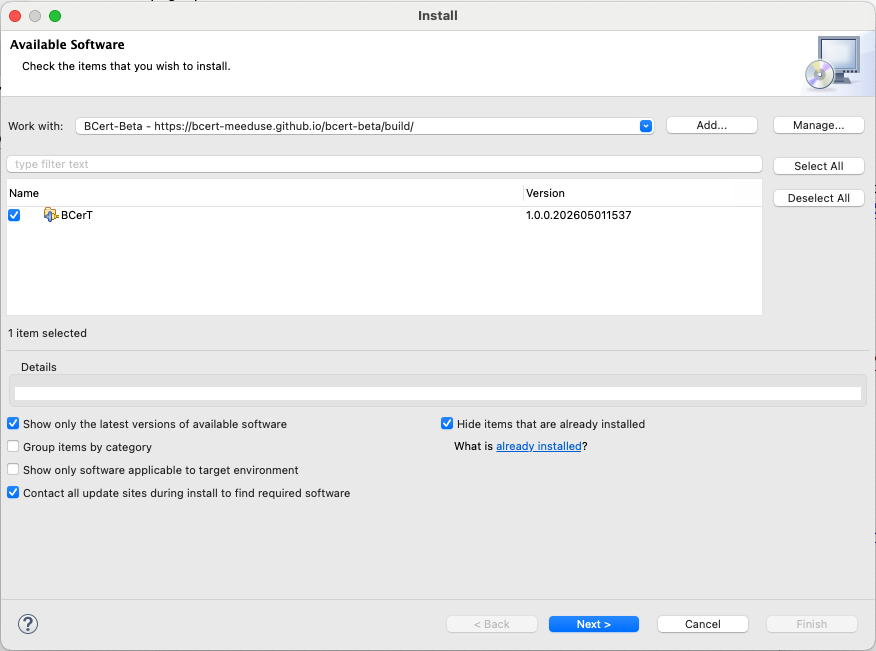

## Description

This page provides the artefacts for the BCerT solution to the TTC 2026 Families to Persons case.

## Step 1: Installation

- Download <a href="https://www.eclipse.org/downloads/packages/release/2025-12/r/eclipse-modeling-tools" target="_blank">**Eclipse Modeling Tools**</a>
- Make sure that Eclipse runs with **Java 17** or later



1. Open **Eclipse**
2. Go to **Help → Install New Software**
3. Add the **B4MSecure update site**: `https://bcert-meeduse.github.io/b4msecure/build/`
5. Add the **BCerT-beta update site**: `https://bcert-meeduse.github.io/bcert-beta/build/`
7. Select **BCerT**
8. Click **Next**
9. Complete the installation wizard
10. Accept the licences
11. Restart Eclipse when prompted

Installation time depends on your network connection because eclipse tries some updates before starting installation.

For general instructions on installing software from update sites, refer to the
<a href="https://help.eclipse.org/latest/topic/org.eclipse.platform.doc.user/tasks/tasks-127.htm?cp=0_3_22_3" target="_blank" rel="noopener">Eclipse documentation</a>.

## Step 2: Download and Import the Solution Project

Download and unzip the archive: <a href="https://bcert-meeduse.github.io/bcert-beta/2026_TTC_fp.zip">2026_TTC_fp.zip</a>

Once extracted, the archive is organized into several folders corresponding to the different transformation scenarios of the TTC case.

The test folders (`1_BatchForward`, `2_BatchBackward`, etc.) provide ready-to-run test files from the TTC 2026 Families-to-Persons benchmark. 

The metamodels used in the case are located in:

- **Families** – Source metamodel  
- **Persons** – Target metamodel  
- **pivot** – Contains our solution, including the CSP specification and the B models of the transformation, which are described later

### Import into Eclipse

1. Open **Eclipse**
2. Go to:   **File → Import...**
3. Select:   **General → Existing Projects into Workspace**
4. Click **Next**
5. Choose **Select root directory**
6. Browse to the extracted folder `2026_TTC_fp`
7. Select all detected projects
8. Click **Finish**

## Step 3: Solution overview with basic scenarios

The folder `0_MainTests` provides basic examples that help understand how synchronization is triggered, observe the effects of rule applications, and get familiar with the overall execution workflow in BCerT.

